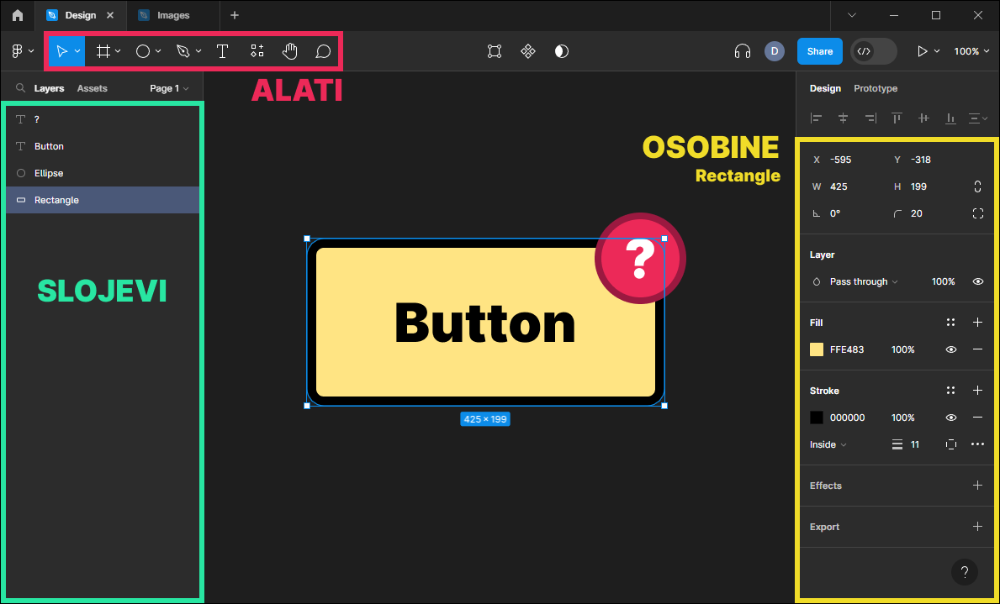
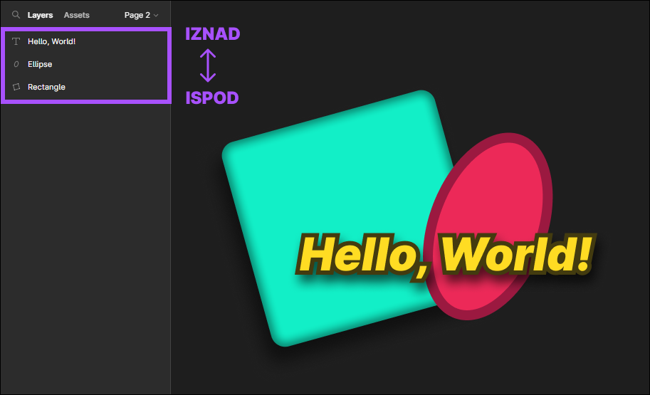
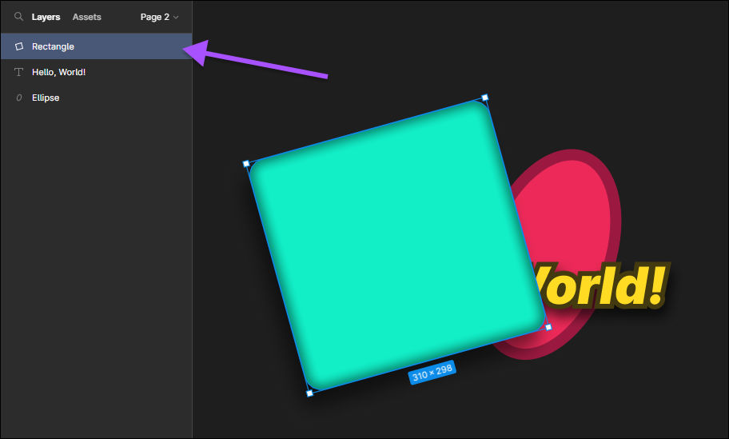
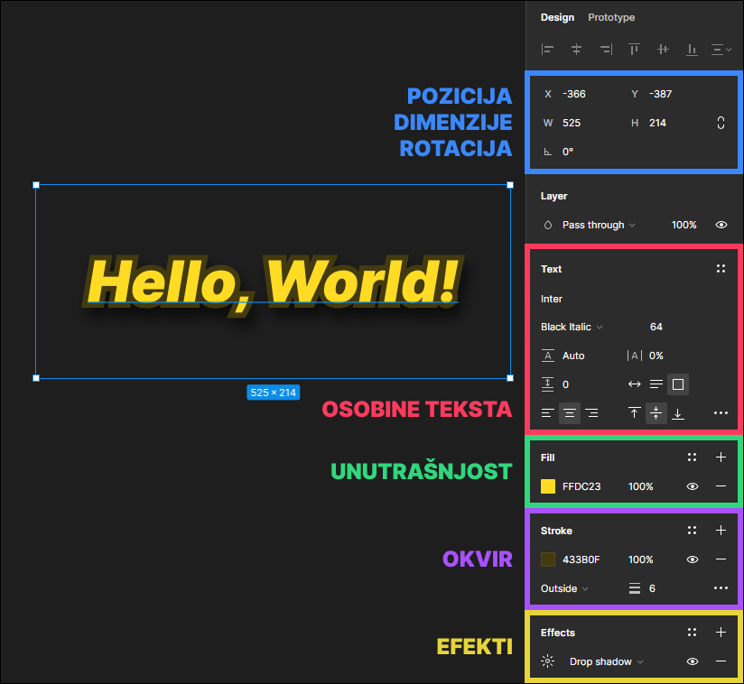
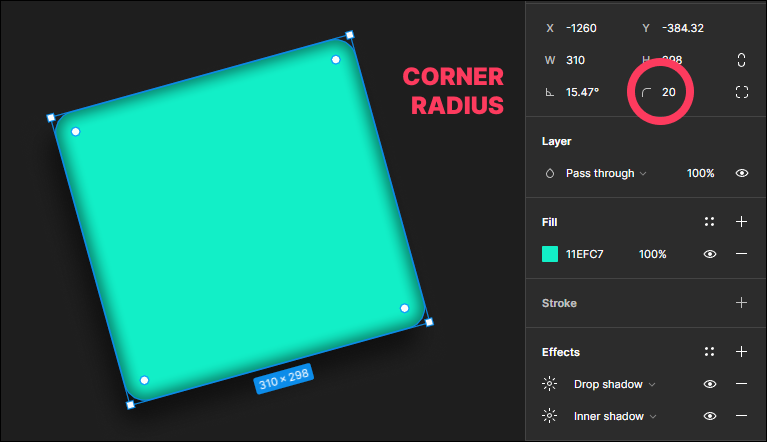

## [Figma](../../) > [Tutorijal](../) > Design

Kreiranje izgleda aplikacije.

## Snimci

[_**Snimak**_](./) (TODO)

## Okruženje za rad

- **Alati** za kreiranje objekata i manipulaciju
- **Slojevi** koji predstavljaju objekte na stranici
- **Osobine** selektovanog objekta

## Slojevi

Redosled objekata u listi slojeva određuje redosled njihovog prikazivanja.

## Osobine

Zajedničke osobine za mnoge tipove objekata:
- Pozicija, Dimenzije, Rotacija
- Unutrašnja površina
- Okvir / Linija
- Efekti

Specifično za tekst objekat:
- Tekst osobine

Specifično za objekte sa isprekidanim linijama:
- Corner radius

